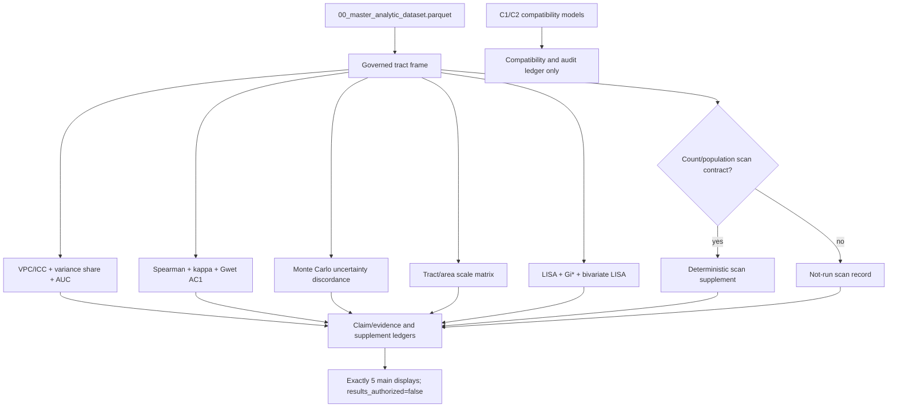

# Add hybrid descriptive complementarity methods

## Goal Capsule

- **Objective:** Make CHM-SAP-002 A1–A7 the reader-facing descriptive framework while retaining C1/C2 life-expectancy models as internal compatibility and audit artifacts.
- **Authority hierarchy:** Frozen source snapshots and dataset contract; approved SAP decisions; result-object gates; `results_authorized=false`; then notebook prose and displays.
- **Stop conditions:** Do not promote an estimate, local cluster, ZIP result, or scan result without governed inputs, uncertainty, denominator, reproducibility, and human authorization.
- **Execution profile:** Test-first statistical modules, then notebook orchestration, then deterministic artifact and browser verification.
- **Tail ownership:** The executor owns implementation, verification, review, and cleanup; SAP-owner decisions and S7 authorization remain human gates.

---

## Product Contract

### Summary

The repository implements a strong descriptive core but not the full method set named in the finalized SAP. This change makes A1–A7 the reader-facing scientific vocabulary while retaining C1/C2 as serialized machine IDs and compatibility outputs only.

### Problem Frame

Community-area summaries can hide tract heterogeneity, while CHM EHR-diagnosed measures and CDC PLACES measures are different estimands. The notebook must quantify alignment, disagreement, geographic coarsening, and local spatial structure without implying validation, prediction, prevalence, causality, superiority, or service need. The source-faithful 22,540 × 90 dataset, direct CHM values, suppression semantics, and `results_authorized=false` are fixed boundaries.

### Requirements

- R1. Add VPC/ICC and within-community variance-share analysis for pooled 2022–2024 tract measures, with community-area bootstrap intervals and crossing-tract sensitivity.
- R2. Add descriptive area-label discriminatory accuracy (AUC) for prespecified high-burden thresholds, avoiding predictive or superiority language.
- R3. Extend CHM–PLACES agreement with Gwet AC1 alongside Spearman and quadratic weighted kappa; retain Spearman as primary concordance.
- R4. Add uncertainty-aware discordance using Monte Carlo propagation of governed PLACES intervals and compatible ACS MOE inputs; fail closed when unavailable or incompatible.
- R5. Recompute supported metrics across tract and community-area scales; retain ZIP/ZCTA as `not_run_no_tract_zcta_crosswalk` unless a governed crosswalk is validated.
- R6. Add local Moran/LISA, Getis-Ord Gi*, and bivariate CHM × PLACES diagnostics with deterministic permutation metadata and BH FDR control.
- R7. Treat spatial scan as a feasibility-gated supplement requiring a governed count/population model and deterministic software provenance.
- R8. Preserve C1/C2 IDs, VIF withholding, candidate status, existing filenames, compatibility CSVs, and `results_authorized=false`; add descriptive `analysis_name` fields.
- R9. Keep exactly 5 main displays; put new detail in numbered eTables/eFigures and machine-readable outputs.
- R10. Extend claim/evidence, display, source, supplement, and manifest ledgers with estimand, unit, denominator, period, uncertainty, diagnostics, sensitivity, source artifact, and authorization.

### A1–A7 Method Map

| ID | Reader-facing analysis | Current status |
|---|---|---|
| A1 | Variance partitioning / VPC-ICC | Not implemented |
| A2 | Area-label discriminatory accuracy (AUC) | Not implemented |
| A3 | CHM–PLACES rank concordance | Spearman/Pearson implemented |
| A4 | Quartile agreement | Weighted kappa implemented; Gwet AC1 absent |
| A5 | Uncertainty-aware discordance | Monte Carlo layer absent |
| A6 | Geographic scale sensitivity | Tract/community comparison implemented; metric expansion needed |
| A7 | Local spatial structure | Global Moran implemented; local methods and scan absent |

### Scope Boundaries

- **In scope:** A1–A7 descriptive methods, tested result objects, supplement artifacts, notebook narrative, provenance, and deterministic verification.
- **Compatibility boundary:** C1 remains withheld for maximum VIF 5.016; C2 remains candidate and unauthorized. Neither becomes a reader-facing estimand.
- **Out of scope:** Composite cardiometabolic index, Bayesian replacement for C1/C2, ICE/equity modeling, disease interpolation, tract rollup, ZIP without a governed crosswalk, or manuscript authorization.
- **Deferred to Follow-Up Work:** A formal SAP deviation if owners retire C1/C2 filenames; external scan software integration if a count model becomes available.

### Success Criteria

- Every A1–A7 row is implemented with a denominator and uncertainty contract or represented by a deterministic not-run/withheld status.
- The notebook explains the hybrid boundary before Results and uses descriptive analysis names in reader-facing outputs.
- Dataset checksums, compatibility outputs, exact 5-display registry, and authorization gate remain stable.
- Two clean script runs produce byte-identical governed artifacts after all changes.

### Dependencies and Sources

- `docs/analysis/finalized_statistical_analysis_plan.md` supplies A1–A7.
- `docs/analysis/analytic_plan_status_and_next_steps.md` supplies the local gap inventory and sequencing.
- `docs/solutions/2026-07-15-analytic-dataset-and-marimo-notebook.md` governs direct-source, no-interpolation handling.
- `docs/solutions/2026-07-15-s5-s6-authority-gate.md` and `docs/solutions/2026-07-14-sap-handoff-stabilization.md` govern authorization and spatial sensitivity boundaries.
- Existing external method citations must be verified through the project literature workflow before entering prose.

---

## Planning Contract

### Key Technical Decisions

- KTD1. **Hybrid SAP boundary (session-settled: user-directed — chosen over replacing the compatibility layer: preserve downstream contracts while adopting the stronger descriptive story).** A1–A7 are reader-facing descriptive analyses; C1/C2 remain internal audit diagnostics and compatibility files.
- KTD2. **No new heavy dependency by default.** Prefer the locked `statsmodels`, `scipy`, `pandas`, `geopandas`, and `shapely` stack; implement small transparent statistics such as Gwet AC1 and BH FDR locally. New PySAL or scan dependencies require a separate reproducibility decision.
- KTD3. **Fail closed on incompatible uncertainty.** Propagate PLACES intervals and ACS MOEs only when fields, units, and geography vintage are explicit; otherwise emit a not-run record.
- KTD4. **Spatial scan feasibility gate.** A scan requires a governed count/population model and deterministic software/version provenance; otherwise emit `not_run_no_governed_scan_population`.
- KTD5. **No new main display.** New metrics land in descriptive eTables/eFigures and machine-readable files; the five-display registry and current compatibility tables remain intact.
- KTD6. **Neutral analysis boundaries.** A shared complementarity-frame/contracts layer feeds A1–A6; spatial methods consume generic aligned frames; reporting, paper displays, and claim audits consume result frames but never calculate statistics. C1/C2 adapters remain isolated from A1–A7.
- KTD7. **Age-standardization is an explicit gate.** If governed age-stratified direct CHM inputs exist, freeze one shared 2000-US-standard transformation before A1–A7. If they do not, emit `not_run_age_standardization_unavailable` and preserve the current direct-measure semantics; never silently standardize from unrelated fields.

### High-Level Technical Design

Statistical logic stays in tested modules; the Marimo notebook remains orchestration and interpretation. Each result object carries `analysis_name`, machine ID when applicable, estimand, unit, denominator, period, uncertainty, diagnostics, sensitivity, authorization, and source artifact.

### Sequencing

1. Freeze the hybrid governance registry and result-object schema.
2. Implement and test variance/AUC methods.
3. Implement and test Gwet AC1, uncertainty propagation, and scale metrics.
4. Implement and test local spatial methods, FDR, and scan feasibility.
5. Integrate notebook cells, supplement registry, claim ledgers, and interpretation layers.
6. Run verification, browser review, code review, and cleanup.

### Risks and Mitigations

- **Small upper-level sample:** Report bootstrap intervals, variance cross-checks, and precision warnings; never use AUC as validation.
- **Estimand mismatch:** Keep concordance language neutral and require explicit uncertainty compatibility.
- **Many local tests:** Apply BH only within named local-cluster families and retain raw values.
- **Spatial islands/dependency:** Reuse canonical weights, checksums, seeds, and fail-closed island policy.
- **Dependency drift:** Bind any added dependency/version to the manifest and avoid additions where transparent local formulas suffice.
- **Governance drift:** Keep compatibility outputs and authorization flags stable while adding descriptive outputs.

---

## Implementation Units

### U1. Establish the hybrid analysis registry and result contract

- **Goal:** Encode reader-facing A1–A7 names and the internal C1/C2 boundary in one tested registry.
- **Requirements:** R8, R9, R10.
- **Dependencies:** None.
- **Files:** `src/chicagohealthmap/analysis/contracts.py`, `src/chicagohealthmap/analysis/paper_audit.py`, `src/chicagohealthmap/analysis/reporting.py`, `src/chicagohealthmap/analysis/paper_displays.py`, `notebooks/00_master_chicago_healthmap_pipeline.py`, `tests/unit/analysis/test_paper_audit.py`, `tests/unit/analysis/test_reporting.py`, `tests/unit/analysis/test_master_notebook_contract.py`.
- **Approach:** Add stable descriptive names, the authoritative A1–A7 map, separate `analysis_id` from `compatibility_model_id`, and a shared `build_complementarity_frame`/result contract covering condition, scale, years, assignment, reliability, suppression, complete-case rules, denominator, and source roles. Preserve C1/C2 machine fields and filenames. Keep analytics dependent only on neutral contracts/errors; reporting and audits consume results but do not calculate metrics.
- **Patterns to follow:** Existing `reader_analysis_name`, claim-evidence audit rows, display registry, and fail-closed authorization.
- **Test Scenarios:**
  1. A1–A7 rows serialize all required evidence fields and descriptive names.
  2. C1/C2 rows retain machine IDs but never enter reader-facing HTML/prose.
  3. Missing denominator, uncertainty, or authorization fails validation.
  4. The main display registry remains exactly 5 entries.
  5. Import-direction tests reject analytics-to-reporting/audit dependencies and C1/C2 model assumptions in A1–A7.
  6. Age-standardization is either bound to one shared helper or serialized as `not_run_age_standardization_unavailable`.
- **Verification:** Contract tests prove naming, compatibility preservation, field completeness, and unchanged authorization.

### U2. Add variance partitioning and descriptive area-label discrimination

- **Goal:** Quantify within- versus between-community-area variation and descriptive area-label discrimination for each condition.
- **Requirements:** R1, R2.
- **Dependencies:** U1.
- **Files:** `src/chicagohealthmap/analysis/tract_complementarity.py`, `src/chicagohealthmap/analysis/contracts.py`, `tests/unit/analysis/test_tract_complementarity.py`.
- **Approach:** Consume the shared frozen complementarity frame. Use pooled 2022–2024 direct tract measures with dominant assignment primary and noncrossing/areal-linkage sensitivity where available. Fit a transparent random-intercept variance decomposition with existing statsmodels support, cross-check with direct between/within sums of squares, bootstrap by community-area cluster, and compute AUC through a tested rank-based formulation for prespecified thresholds. Label it discriminatory accuracy, not prediction or validation.
- **Execution note:** Start with characterization tests for crossing-tract handling and degenerate clusters before changing the statistical module.
- **Patterns to follow:** `build_tract_percentile_concordance`, `cluster_bootstrap_concordance`, direct derivation and suppression filters, deterministic seed metadata.
- **Test Scenarios:**
  1. Known synthetic within/between variance recovers expected shares.
  2. One-area and constant-measure inputs fail closed.
  3. Bootstrap resampling preserves community clusters and deterministic seeds.
  4. Median, tertile, and 75th-percentile thresholds produce distinct labeled sensitivities.
  5. Crossing sensitivity changes denominators without interpolating disease values.
- **Verification:** Per-condition VPC/ICC, variance share, AUC, CI, n, threshold, assignment rule, and precision warning appear in a diagnostic eTable with `results_authorized=false`.

### U3. Extend concordance with Gwet AC1, uncertainty propagation, and scale metrics

- **Goal:** Separate rank agreement, categorical agreement, and uncertainty-exceeding discordance across supported scales.
- **Requirements:** R3, R4, R5.
- **Dependencies:** U1.
- **Files:** `src/chicagohealthmap/analysis/tract_complementarity.py`, `src/chicagohealthmap/analysis/contracts.py`, `tests/unit/analysis/test_tract_complementarity.py`, `tests/unit/analysis/test_case_studies.py`.
- **Approach:** Consume the same shared frozen frame as A1/A2 without importing their model objects. Add Gwet AC1 with marginal and boundary checks. Build a seeded Monte Carlo layer that samples only governed PLACES intervals and compatible ACS MOE-derived quantities, records replicate count and seed, and classifies gaps under a prespecified rule. Recompute supported metrics for tract and direct community-area frames. Emit ZIP as not-run unless a validated crosswalk appears in the source manifest.
- **Test Scenarios:**
  1. Known 2×2 and 4×4 marginals recover hand-calculated AC1 and weighted kappa.
  2. Degenerate marginals return non-estimable status rather than zero.
  3. Identical seeded Monte Carlo runs produce identical summaries and metadata.
  4. Missing intervals or incompatible MOEs produce `not_run_uncertainty_unavailable`.
  5. Scale metrics preserve direct community values and never aggregate tract disease values.
- **Verification:** Concordance and scale eTables expose estimator, uncertainty source, denominator, scale, vintage, and not-run reasons; Spearman remains primary.

### U4. Add local spatial clustering, bivariate agreement, FDR, and scan feasibility

- **Goal:** Extend global Moran diagnostics into deterministic local spatial summaries without overstating clusters.
- **Requirements:** R6, R7, R10.
- **Dependencies:** U1.
- **Files:** `src/chicagohealthmap/analysis/spatial.py`, `src/chicagohealthmap/analysis/contracts.py`, `tests/unit/analysis/test_spatial.py`.
- **Approach:** Consume generic aligned frames and reuse canonical weights/permutation metadata. Add a typed spatial-result schema containing statistic family, geography IDs, checksum, seed/permutations, raw/adjusted p values, FDR family, denominator, and status. Add local Moran/LISA, Getis-Ord Gi*, and bivariate CHM×PLACES statistics with raw/BH-adjusted values, cluster labels, and aggregation attenuation summaries. Check scan prerequisites and emit a deterministic not-run record when count/population provenance is absent; optional backends must plug in without a silent external binary.
- **Test Scenarios:**
  1. Synthetic hotspot and checkerboard geometries recover expected labels under fixed permutations.
  2. Islands, constant measures, missing comparators, and nonfinite inputs fail closed.
  3. BH adjustment is scoped to each declared family and preserves raw p values.
  4. Bivariate labels distinguish high-high, low-low, and cross-pattern states.
  5. Scan output is not-run without the count/population contract and runnable only when complete.
- **Verification:** Supplement maps/tables include weights checksum, seed, permutations, raw/adjusted p values, FDR family, denominator, and authorization.

### U5. Integrate the paper-ordered notebook and supplement gallery

- **Goal:** Make the hybrid story visible from dataset assembly through interpretation and export.
- **Requirements:** R8, R9, R10.
- **Dependencies:** U1–U4.
- **Files:** `notebooks/00_master_chicago_healthmap_pipeline.py`, `src/chicagohealthmap/analysis/reporting.py`, `src/chicagohealthmap/analysis/paper_displays.py`, `tests/unit/analysis/test_master_notebook_contract.py`, `tests/integration/test_master_notebook.py`.
- **Approach:** Add technical Markdown before each A1–A7 calculation, explain the hybrid boundary before Results, write descriptive eTables/eFigures and not-run records, retain exactly 5 main displays, and keep C1/C2 in a compatibility/audit subsection. Distinguish numbered supplement displays from machine-readable diagnostics.
- **Test Scenarios:**
  1. Top-to-bottom execution writes all new artifacts and preserves the dataset contract.
  2. Notebook headings and adjacency place assembly, A1–A7 methods, interpretation layers, and gallery in paper order.
  3. Rendered HTML contains descriptive names and no reader-facing C1/C2/planning labels.
  4. Existing C1/C2 compatibility files remain with unchanged machine fields and closed authorization.
- **Verification:** Strict Marimo, browser run-all, registry validation, and exact five-display checks pass without alerts.

### U6. Complete provenance, deterministic verification, and review gates

- **Goal:** Prove the hybrid layer is reproducible, source-bound, and reviewable before authorization changes.
- **Requirements:** R8, R10 and all success criteria.
- **Dependencies:** U1–U5.
- **Files:** `src/chicagohealthmap/analysis/dataset.py`, `src/chicagohealthmap/analysis/dataset_artifacts.py`, `src/chicagohealthmap/analysis/contracts.py`, `docs/analysis/master_notebook_manuscript_plan.md`, `tests/unit/analysis/test_dataset.py`, `tests/unit/test_governance_document_contract.py`.
- **Approach:** Extend manifests with method versions, seeds, uncertainty inputs, FDR families, scan status, age-standardization status, and claim-to-source links. Do not edit the finalized SAP silently; record any required deviation for human sign-off. Verify locked environment, checksums, two-run equality, formatting, typing, full pytest, strict Marimo, browser rendering, grayscale/CVD QA, and final code review.
- **Execution note:** Run verification only after method and notebook cells stabilize; resolve every verified P0–P2 finding before completion.
- **Test Scenarios:**
  1. Two clean runs produce identical substantive outputs and method metadata.
  2. A changed source checksum forces rebuild and records the reason.
  3. Missing method artifacts or citations fail the gallery/claim contract.
  4. Authorization remains false even when diagnostics execute successfully.
  5. C1/C2 adapter outputs remain stable and are not routed into A1–A7 result objects.
- **Verification:** The final manifest binds inputs, code, lockfile, SAP, output hashes, seeds, method status, and authorization; abandoned experimental code is removed and the worktree is clean.

---

## Verification Contract

| Gate | Evidence | Applies to |
|---|---|---|
| Unit tests | New method tests plus existing analysis contracts pass | U1–U4 |
| Static checks | Ruff check/format and mypy | U1–U6 |
| Notebook structure | Strict Marimo, cells ≤30 lines, exact sequence | U5 |
| Script execution | Top-to-bottom master script writes complete gallery without alerts | U5–U6 |
| Scientific contracts | Dataset, source roles, no interpolation, C1/C2 compatibility, A1–A7 fields, not-run states | U1–U6 |
| Determinism | Two clean runs have identical governed hashes | U6 |
| Visual QA | Journal dimensions, grayscale, protanopia/deuteranopia, legends and denominators | U5–U6 |
| Review | Compound Engineering review resolves verified P0–P2 findings | U6 |

## Definition of Done

- A1–A7 are implemented or explicitly fail closed with a reasoned serialized status.
- C1/C2 compatibility artifacts and authorization gates remain intact; reader-facing prose uses descriptive A1–A7 names.
- New outputs have tests, source/claim lineage, denominators, uncertainty, sensitivity, and method metadata.
- Exactly 5 main displays remain; new method evidence is supplementary without duplicated primary coefficients.
- All gates pass, two-run outputs match, review is resolved, abandoned code is removed, and the worktree is clean.
- No manuscript result becomes authorized without human SAP/S7 approval; `results_authorized=false` remains binding.

## Appendix: Current Status Matrix

| Method family | Current status | Hybrid disposition |
|---|---|---|
| VPC/ICC + AUC | Not implemented | U2 |
| Spearman + weighted kappa | Implemented | Preserve and extend in U3 |
| Gwet AC1 | Not implemented | U3 |
| PLACES/ACS uncertainty propagation | Not implemented | U3, fail closed when incompatible |
| Tract/community scale sensitivity | Partially implemented | U3; ZIP remains gated |
| Global Moran/spatial error | Implemented | Preserve in U4 |
| LISA/Gi*/bivariate LISA | Not implemented | U4 |
| Spatial scan | Not implemented | U4 feasibility gate |
| FDR for local clusters | Not implemented | U4 |
| C1/C2 compatibility models | Implemented with boundaries | Preserve under KTD1 |
