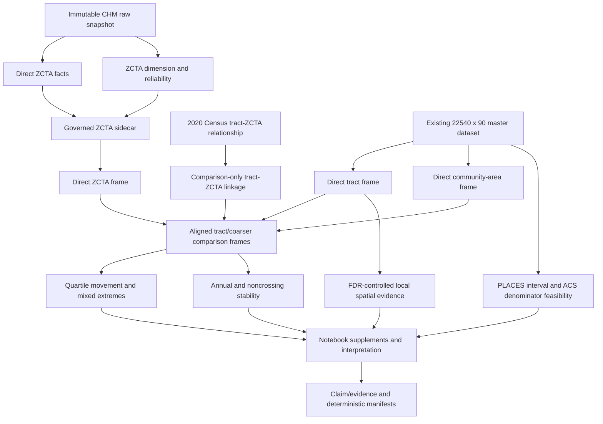

# Add geographic consequences and direct ZCTA sensitivity

## Goal Capsule

- **Objective:** Extend the master Marimo notebook with decision-relevant measures of tract information loss, stability, FDR-controlled spatial persistence, uncertainty feasibility, and a direct CHM ZCTA sensitivity that can travel beyond Chicago's community-area geography.
- **Authority hierarchy:** Immutable first-party snapshot and S4 position evidence; existing 22,540 x 90 master-dataset contract; approved SAP and descriptive addendum; result-object gates; `results_authorized=false`; then notebook prose and displays.
- **Stop conditions:** Do not derive ZCTA disease values from tracts, call denominators unique patients, combine unrelated uncertainty sources, promote unadjusted local clusters, or claim transportability beyond the observed six-county source frame.
- **Execution profile:** Characterize source semantics first, implement statistical objects test-first, integrate supplementary displays, then run deterministic and browser verification.
- **Tail ownership:** The executor owns implementation, verification, review, and cleanup. Semantic approval of the ZCTA geography mapping, any SAP deviation, and manuscript-result authorization remain human gates.

---

## Product Contract

### Summary

The notebook currently demonstrates tract-to-community-area reclassification but does not translate that finding into the number of affected tracts or represented-adult denominators, identify coarser areas containing both high- and low-ranked tracts, quantify annual stability, summarize how many local clusters survive false-discovery-rate control, or exploit the direct ZCTA stream in the first-party export. This follow-up adds those consequences without changing the primary analytic dataset or presenting tract resolution as universally superior.

The prior hybrid-methods Product Contract remains unchanged. This plan adds consequence-focused outputs and replaces the obsolete `not_run_no_tract_zcta_crosswalk` assumption with a governed direct-ZCTA feasibility path.

### Problem Frame

Community areas are meaningful within Chicago but are not a generally reusable geography. The CAPriCORN/ChicagoHealthMap export contains 66,903 direct ZCTA-condition-year records, 400 ZCTA dimension rows with geometry, and 400 ZCTA reliability rows across the six-county provenance frame. The scientific opportunity is therefore not to manufacture ZIP summaries from tracts. It is to compare direct tract observations with direct community-area and direct ZCTA observations after linking geography boundaries for comparison only.

The raw source still has governance gaps: ZCTA key positions are not yet accepted in the S4 geography map, the geometry position needs validation, denominator position 25 remains guarded, and the direct ZCTA stream is not part of the frozen builder. ZCTAs are Census statistical approximations of ZIP Code delivery areas, not USPS ZIP Codes, and the source cannot support claims about national generalizability.

### Requirements

#### Direct ZCTA source and linkage

- R1. Audit and govern the direct ZCTA geography key, geometry, facts, capture, reliability, suppression, condition-family, period, checksum, and lineage fields from the frozen first-party snapshot.
- R2. Preserve the 22,540 x 90 primary dataset and existing CLI defaults; emit direct ZCTA facts as a deterministic sidecar artifact rather than silently changing the master contract.
- R3. Link Chicago tracts to direct ZCTAs using a frozen, vintage-compatible 2020 Census tract-to-ZCTA relationship with overlap metadata; use the link only to compare direct values, never to derive clinical values.
- R4. Distinguish ZCTAs from USPS ZIP Codes in every reader-facing label and retain six-county source provenance separately from the Chicago tract analysis frame.

#### Geographic consequences

- R5. For each supported condition and coarser geography, classify tracts as remaining high, moving out of the highest quartile, moving into it, or remaining below it; report tract counts, percentages, and mean annual observed-adult denominators without implying unique people.
- R6. Identify community areas and ZCTAs that contain both highest- and lowest-quartile direct CHM tracts, including eligible tract counts, denominator summaries, crossing status, and direct coarser-geography rank.
- R7. Quantify pooled-versus-annual and all-eligible-versus-noncrossing stability with common denominators, transition matrices, top-quartile Jaccard agreement, and explicit unavailable states.
- R8. Report local Moran, Gi*, and bivariate CHM x PLACES classifications before and after BH FDR adjustment, with each correction family, weights checksum, seed, permutations, denominator, and annual persistence status explicit.
- R9. Attempt uncertainty-aware agreement only when source roles are compatible: PLACES intervals may inform comparator-rank uncertainty, and ACS adult-population MOEs may inform capture-denominator uncertainty. Never add ACS uncertainty to a PLACES estimate. Retain an explicit not-run state when a joint estimand is not defensible.

#### Notebook and governance

- R10. Add consequence interpretations, Great Tables, supplementary figures, claim-evidence rows, and deterministic artifacts while retaining exactly five main displays, no cardiometabolic coefficient, and `results_authorized=false`.
- R11. Keep direct CHM condition values uninterpolated and preserve the existing governed diabetes-family rule; any ZCTA-specific difference in component availability must fail closed rather than silently change the definition.

### Scope Boundaries

- **In scope:** Direct ZCTA sidecar assembly; tract-ZCTA comparison linkage; community-area and ZCTA consequence metrics; annual and boundary sensitivities; FDR survival summaries; uncertainty feasibility; supplementary Great Tables/figures; notebook interpretation; provenance and tests.
- **Compatibility boundary:** The primary 22,540 x 90 dataset, 90-column schema, dataset CLI default, C1/C2 compatibility IDs, five main displays, C1 VIF withholding, C2 candidate status, and `results_authorized=false` remain unchanged.
- **Outside this product's identity:** USPS address or delivery-route analysis, patient-level inference, national generalization, disease interpolation, ZCTA values aggregated from tracts, or causal/resource-need claims.
- **Deferred to Follow-Up Work:** Multi-city replication using another health system; patient-level deduplication; a probability-sample estimand; promotion of a ZCTA display into the main five before findings and authorization are reviewed.

### Acceptance Examples

- AE1. Given a tract that is direct-CHM Q4 but whose linked direct community-area value is not Q4, the consequence table classifies it as moving out under community-area coarsening and adds its mean annual observed-adult denominator once.
- AE2. Given the same tract linked to a direct ZCTA that is Q4, the ZCTA result classifies it as remaining high without copying or averaging its tract disease value into the ZCTA record.
- AE3. Given a coarser geography containing at least one Q1 and one Q4 tract, the mixed-extremes table identifies the geography and reports its tract and denominator accounting; a geography with only Q2-Q4 does not qualify.
- AE4. Given a tract crossing a community or ZCTA boundary, the primary dominant-link result retains it and the noncrossing sensitivity excludes it using a prespecified coverage threshold.
- AE5. Given local clusters with raw P values below .05 but BH-adjusted values at or above .05, the notebook reports zero FDR-surviving clusters rather than describing hotspots.
- AE6. Given parseable PLACES intervals but no defensible role for ACS MOE in the agreement estimand, PLACES-only comparator uncertainty is labeled separately and joint uncertainty remains `not_run_incompatible_uncertainty_contract`.

### Success Criteria

- The ZCTA sidecar reproduces the governed source counts or explains every exclusion, retains all direct-source keys, and has deterministic schema, lineage, manifest, and checksum artifacts.
- Every consequence row names condition, comparison geography, period, assignment rule, denominator unit, missingness, sensitivity, uncertainty, source artifacts, and authorization.
- Tract and denominator movements reconcile exactly to the eligible comparison frame for community areas and ZCTAs.
- Raw and FDR-adjusted spatial classifications are separately countable and never represented as significant when the adjusted threshold is not met.
- Uncertainty outputs either execute with source-role-valid inputs or fail closed with a specific reason.
- The notebook remains paper ordered, browser-clean, deterministic across two runs, and limited to five main displays.

---

## Planning Contract

### Key Technical Decisions

- KTD1. **Direct ZCTA sidecar, not a tract rollup (session-settled: user-directed — chosen over abandoning ZIP-scale analysis or constructing ZIP values from tracts: the raw export contains direct ZCTA facts, dimensions, and reliability records).** The sidecar preserves source geography and is joined to tracts only for comparison.
- KTD2. **Preserve the primary dataset contract.** Adding six-county ZCTA rows to the 22,540-row Chicago paper dataset would change its frame, denominators, public joins, and downstream tests. A separately checksummed sidecar allows the notebook to analyze direct ZCTA evidence without breaking the primary interface.
- KTD3. **Use an official 2020 Census tract-to-ZCTA relationship as primary linkage.** The relationship file provides same-vintage tract/ZCTA overlap areas. Dominant land-area assignment is primary because the file has no population counts; complete or near-complete containment defines the noncrossing sensitivity. Source geometry overlay is a checksum-bound cross-check, not a competing clinical aggregation.
- KTD4. **Use mean annual source denominator, never unique adults.** For pooled 2022-2024 classification, average each eligible tract's annual position-25 denominator before summing transition categories. Annual analyses use that year's denominator. Reader-facing “observed-adult denominator” language is allowed only after the existing S4 denominator audit passes; otherwise displays retain “source position-25 denominator.” People may recur across years and conditions.
- KTD5. **Compare direct ranks at each source scale.** Tract, community-area, and ZCTA ranks are calculated within the same condition and period from their direct source measures. Mapped coarser ranks are metadata attached to tract records; no measure is interpolated or reconstructed.
- KTD6. **Freeze stability definitions.** Report exact classification agreement, Q4-set Jaccard agreement, and the four-state transition matrix. A pooled classification is called annually persistent only when the same state appears in at least two of three annual analyses on a common eligible tract set; report each year regardless of persistence.
- KTD7. **FDR families are condition x period x statistic.** BH adjustment is performed separately for local Moran, Gi*, and bivariate LISA within each named condition-period family. Production uses 9,999 deterministic permutations so the attainable P-value resolution can support BH-adjusted .05 findings; test fixtures use smaller runs without asserting publishable significance. Permutations are processed in bounded batches so notebook memory does not scale with all families at once.
- KTD8. **Separate uncertainty sources.** PLACES confidence intervals perturb only the PLACES comparator. ACS MOEs perturb only the ACS adult-population denominator and derived capture quantities. A joint probability is not calculated unless a reviewed estimand defines how those sources combine; the current practice of adding ACS noise to PLACES draws must be retired before A5 can run.
- KTD9. **Supplement first.** ZCTA and consequence displays enter numbered eTables/eFigures and the coauthor interpretation guide. Promotion into a main display requires post-result scientific review and cannot increase the five-display count.

### High-Level Technical Design

### Data and Statistical Contracts

- **Direct ZCTA grain:** `zcta_id / time_period / source_condition_id`; retain both diabetes components as source rows and derive the governed diabetes family only when both components are present.
- **Tract-ZCTA link grain:** `tract_geoid / zcta_id`, with intersection land area, tract covered fraction, ZCTA covered fraction, dominant flag, crossing flag, relationship vintage, and source checksum.
- **Consequence grain:** `condition_id / period / comparison_geography_type / sensitivity / transition_state`, with tract count, tract percentage, mean-annual observed denominator, denominator percentage, and authorization.
- **Mixed-extremes grain:** `condition_id / period / comparison_geography_type / comparison_geography_id / sensitivity`.
- **Spatial survival grain:** `condition_id / period / statistic_family / cluster_label / adjustment_state`, retaining raw and adjusted counts without treating absence of significance as evidence of spatial randomness.
- **Uncertainty grain:** one result-object row per condition and uncertainty source role, plus tract-level probabilities only when the contract is eligible.

### Risks and Mitigations

- **Unverified ZCTA key/geometry semantics:** Require source-profile, uniqueness, geometry, and cross-table concordance tests before analysis; fail closed if S4 mapping is not accepted.
- **Boundary-vintage mismatch:** Bind the official 2020 relationship version and report unmatched or split tracts; do not substitute centroid assignment.
- **Denominator overinterpretation:** Label totals as mean annual observed-adult denominators, never people or population coverage, and preserve the guarded-source-position note.
- **Diabetes double counting:** Require both source components for a derived diabetes value and test missing-component behavior at every scale.
- **Multiplicity and low permutation resolution:** Freeze FDR families and production permutation count; report raw and adjusted evidence separately.
- **Uncertainty construct mismatch:** Separate PLACES and ACS simulation roles and retain a deterministic not-run record when no joint estimand is defensible.
- **Narrative overreach:** Use complementarity and boundary sensitivity language only; prohibit validation, superiority, prevalence, causality, underdiagnosis, access failure, service need, and national transportability claims.

### System-Wide Impact

- **Source acquisition and governance:** The frozen source registry gains an official Census relationship artifact, while the first-party S4 map gains ZCTA positions. Both changes must preserve immutable source identity and ignored raw bytes.
- **Dataset interfaces:** The primary builder, output-stem behavior, 22,540 x 90 dataset, and downstream model frames remain unchanged. The sidecar uses parallel artifact conventions and enters the notebook through an explicit secondary interface.
- **Analysis modules:** Community-specific aggregation-loss helpers become geography-generic without changing current community-area outputs. Spatial and uncertainty modules gain stricter family/source-role contracts that may change previously diagnostic-only artifacts but not authorized results.
- **Notebook and manuscript handoff:** The supplement registry, interpretation guide, claim ledger, and run-manifest output count expand. Main display IDs and existing table/figure filenames remain stable.
- **Runtime and reproducibility:** ZCTA parsing and 9,999-permutation spatial diagnostics increase execution cost. Batch processing, deterministic seeds, cached governed artifacts, and two-run checks constrain the impact.
- **Human governance:** The notebook can show audited candidate evidence, but S4 semantic acceptance, any SAP deviation, and S7 authorization remain outside automated execution.

---

## Implementation Units

### U1. Govern and assemble the direct ZCTA sidecar

- **Goal:** Make the frozen direct ZCTA stream source-faithful and notebook-ready without changing the primary analytic dataset.
- **Requirements:** R1, R2, R4, R11.
- **Dependencies:** None.
- **Files:** `docs/analysis/s4_methods_mapping.json`, `src/chicagohealthmap/governance/s4_dictionary.py`, `src/chicagohealthmap/analysis/dataset.py`, `src/chicagohealthmap/analysis/dataset_artifacts.py`, `tests/unit/test_s4_dictionary.py`, `tests/unit/analysis/test_dataset.py`.
- **Approach:** Extend the accepted geography map to ZCTA fact position 2, dimension/reliability position 1, and validate dimension geometry position 15. Add the three ZCTA source files to a sidecar input contract with byte/hash checks. Reuse guarded fact parsing, suppression, capture, reliability, diabetes-family, schema, lineage, data-book, reuse, and rebuild patterns while giving the sidecar its own dataset ID and output stem.
- **Execution note:** Begin with failing source-profile and artifact-contract tests; do not infer semantic fields from values that lack S4 evidence.
- **Patterns to follow:** `_case_fact_records`, `_fact_table_audit`, `AnalyticDatasetArtifacts`, source-join manifests, and immutable first-party snapshot verification.
- **Test Scenarios:**
  1. The 400 dimension keys and 400 reliability keys are unique and cross-table-valid; the fact table has 66,903 rows before governed filtering and 6 periods.
  2. ZCTA fact rows map geography, year, condition, numerator, guarded denominator, and published measure from the accepted positions without altering values.
  3. Geometry hex decodes to valid polygonal WGS84 geometry; malformed, empty, duplicate, or nonpolygon geometry fails closed.
  4. Suppressed and missing measures remain distinct from zero.
  5. A missing diabetes component prevents a derived diabetes-family row for that ZCTA-period.
  6. Matching inputs reuse the sidecar; a changed source checksum rebuilds it and records the reason.
  7. Building the sidecar leaves the primary 22,540 x 90 dataset and default CLI artifact names unchanged.
- **Verification:** The sidecar's Parquet, CSV, schema, lineage, source/join manifest, and data book reconcile to the source audit and carry `results_authorized=false`.

### U2. Add a governed tract-to-ZCTA comparison linkage

- **Goal:** Attach each eligible Chicago tract to its direct ZCTA counterpart with auditable boundary metadata.
- **Requirements:** R3, R4.
- **Dependencies:** U1.
- **Files:** `config/source_registry.yml`, `sources/SOURCE_REGISTRY.yml`, `src/chicagohealthmap/sources/adapters/census.py`, `src/chicagohealthmap/external/geography.py`, `src/chicagohealthmap/external/normalize.py`, `tests/integration/sources/test_census_snapshot.py`, `tests/unit/external/test_geography.py`.
- **Approach:** Acquire and preserve the official 2020 Census ZCTA-to-tract relationship and record layout. Normalize Illinois relationships with overlap land/water areas and derive dominant, crossing, and coverage fields. Cross-check source ZCTA geometry against the official relationship and bind both checksums. Linkage fields are metadata only.
- **Patterns to follow:** Census snapshot adapters, tract-community overlay validation, projected-area checks, sorted geography keys, and no-neighbor/no-match fail-closed behavior.
- **Test Scenarios:**
  1. One-to-one contained tracts receive a single dominant ZCTA and noncrossing status.
  2. Split tracts retain all relationships, choose the maximum-land-area ZCTA deterministically, and are excluded from noncrossing sensitivity.
  3. Overlap fractions reconcile within tolerance; duplicate or missing tract relationships fail validation.
  4. Vintage, GEOID width, source checksum, and relationship-record layout are explicit.
  5. Linkage never creates or changes numerator, denominator, or published-measure fields.
- **Verification:** The frozen link table has a unique dominant row per eligible tract, complete unmatched/split accounting, and checksum parity with its manifest.

### U3. Build geographic consequence and stability result objects

- **Goal:** Translate scale sensitivity into tract and denominator consequences for community areas and ZCTAs.
- **Requirements:** R5, R6, R7, R11.
- **Dependencies:** U1, U2.
- **Files:** `src/chicagohealthmap/analysis/tract_complementarity.py`, `src/chicagohealthmap/analysis/contracts.py`, `tests/unit/analysis/test_tract_complementarity.py`.
- **Approach:** Generalize the community-area aggregation-loss logic to accept a typed coarser-geography link and direct coarser rank frame. Produce four-state Q4 transitions, mixed Q1/Q4 groups, denominator accounting, annual matrices, pooled/common-set comparisons, Jaccard agreement, and noncrossing results. Keep hyperlipidemia in direct CHM scale analyses but omit CHM-PLACES metrics unless a construct-matched comparator is governed.
- **Execution note:** Implement synthetic reconciliation cases before applying the functions to frozen data.
- **Patterns to follow:** `build_direct_ehr_rank_frame`, `summarize_community_area_aggregation_loss`, `summarize_within_community_heterogeneity`, deterministic percentile ranks, and neutral interpretation labels.
- **Test Scenarios:**
  1. Covers AE1-AE4 with exact four-state tract and denominator reconciliation.
  2. Tied quartile boundaries use the frozen rank rule consistently across all geography types.
  3. Pooled mean-annual denominators count each tract once; annual results use the matching year only.
  4. Missing direct coarser values reduce the eligible denominator with an explicit reason rather than imputing rank.
  5. Mixed-extremes classification requires both Q1 and Q4 and remains stable under row reordering.
  6. Annual persistence uses a common eligible set and reports each year's state plus the two-of-three classification.
  7. Community-area and ZCTA result objects carry distinct comparison labels, link checksums, sensitivity states, and authorization.
- **Verification:** Transition totals, denominator totals, mixed-area counts, Jaccard values, and stability classifications are reproducible and internally reconciled.

### U4. Audit FDR-surviving and persistent local spatial classifications

- **Goal:** Answer whether apparent hotspots survive multiplicity control and whether their signed classifications recur.
- **Requirements:** R8, R10.
- **Dependencies:** U3.
- **Files:** `src/chicagohealthmap/analysis/spatial.py`, `src/chicagohealthmap/analysis/paper_audit.py`, `tests/unit/analysis/test_spatial.py`, `tests/unit/analysis/test_paper_audit.py`.
- **Approach:** Extend local diagnostics to accept explicit condition and period family identifiers, pass the PLACES comparator for bivariate LISA, retain raw and BH-adjusted rows, and build a survival summary. Add pooled and annual signed-label persistence without weakening the FDR threshold. Treat zero survivors as a valid result and not proof of no clustering.
- **Test Scenarios:**
  1. Covers AE5: raw-only clusters do not enter the FDR-surviving count or prose.
  2. BH adjustment is isolated by condition, period, and statistic family.
  3. Local Moran, Gi*, and bivariate LISA use the same sorted tract frame and weights checksum.
  4. Fixed seeds and permutations produce identical raw, adjusted, and persistence outputs.
  5. Missing PLACES data emits a bivariate not-run row while univariate families remain eligible.
  6. Annual persistence requires the same signed label and adjusted significance under the frozen recurrence rule.
- **Verification:** Every spatial claim traces to raw and adjusted evidence, the correction family, denominator, weights, seed, permutations, and authorization.

### U5. Correct and gate uncertainty-aware agreement

- **Goal:** Determine which uncertainty-aware comparisons are scientifically executable and preserve explicit not-run states for incompatible constructs.
- **Requirements:** R9, R10.
- **Dependencies:** U1, U3.
- **Files:** `src/chicagohealthmap/analysis/dataset.py`, `src/chicagohealthmap/analysis/uncertainty_analysis.py`, `src/chicagohealthmap/external/census_covariates.py`, `tests/unit/analysis/test_dataset.py`, `tests/unit/analysis/test_uncertainty_analysis.py`.
- **Approach:** Parse normalized PLACES confidence-interval strings into validated numeric bounds. Build tract ACS adult-population estimates and MOEs from governed B01001 components using the existing Census uncertainty machinery. Replace the current mixed-source perturbation with separate source-role result objects: PLACES-only rank uncertainty, ACS capture-denominator uncertainty, and a joint feasibility row. A joint simulation remains not run unless a reviewed estimand links the sources.
- **Execution note:** Add characterization coverage showing that the current function fails closed with today's inputs before changing its simulation contract.
- **Patterns to follow:** normalized source-field maps, ACS variance handling, `validate_analysis_result`, seeded Monte Carlo metadata, and explicit unavailable/incompatible states.
- **Test Scenarios:**
  1. Valid interval strings produce ordered finite bounds; malformed, reversed, or out-of-range intervals fail closed.
  2. PLACES draws alter only comparator ranks and reproduce exactly under a fixed seed.
  3. ACS MOE draws alter only adult-population/capture quantities and never PLACES estimates.
  4. Covers AE6: missing source-role linkage retains `not_run_incompatible_uncertainty_contract` for the joint result.
  5. Missing MOE states, vintage mismatch, or incomplete B01001 components produce specific not-run reasons.
  6. Eligible outputs include replicate count, seed, source vintage, uncertainty role, denominator, and authorization.
- **Verification:** No result combines unrelated uncertainty sources; eligible and not-run outputs are both deterministic and claim-auditable.

### U6. Integrate consequence evidence into the paper-ordered notebook

- **Goal:** Add a clear Results story and selectable supplementary displays without disrupting the five main displays.
- **Requirements:** R4-R10.
- **Dependencies:** U1-U5.
- **Files:** `notebooks/00_master_chicago_healthmap_pipeline.py`, `src/chicagohealthmap/analysis/reporting.py`, `src/chicagohealthmap/analysis/paper_displays.py`, `tests/unit/analysis/test_master_notebook_contract.py`, `tests/unit/analysis/test_reporting.py`, `tests/unit/analysis/test_paper_displays.py`, `tests/integration/test_master_notebook.py`.
- **Approach:** Add a Methods subsection for direct ZCTA provenance and comparison-only linkage, then place consequence results after the existing tract complementarity evidence. Add Great Tables for transition and mixed-area summaries; eFigures for Q4 movement, mixed-extreme maps, annual/noncrossing stability, FDR survival, and ZCTA coverage; and a feasibility table for uncertainty. Generate technical and coauthor interpretations directly from governed objects and update the interpretation-guide JSON.
- **Patterns to follow:** Great Tables HTML plus editable CSV, numbered supplement registry, deterministic vector/raster export, technical Markdown immediately before output, and cells no longer than 30 lines.
- **Test Scenarios:**
  1. Notebook order is source evidence, methods, consequences, sensitivities, interpretation, then serialization.
  2. Reader-facing text says ZCTA rather than ZIP when referring to Census areas and explains the distinction once.
  3. Exactly five main displays remain; all new displays are numbered supplements or QC-only artifacts.
  4. Dynamic narrative values match consequence, FDR, stability, and uncertainty result objects.
  5. No C1 coefficient, causal language, national-generalizability claim, unique-patient claim, or authorized-result language appears.
  6. Great Tables HTML and editable CSV contain matching rows, notes, denominators, and missing-value symbols.
- **Verification:** The live notebook renders every new table and figure without errors, clipped labels, duplicate evidence, or contradictory authorization language.

### U7. Reconcile ledgers, determinism, and scientific review

- **Goal:** Bind the new source and consequence evidence to reproducibility artifacts and complete review gates.
- **Requirements:** R1-R11.
- **Dependencies:** U1-U6.
- **Files:** `src/chicagohealthmap/analysis/paper_audit.py`, `src/chicagohealthmap/analysis/dataset_artifacts.py`, `docs/analysis/master_notebook_manuscript_plan.md`, `tests/unit/analysis/test_paper_audit.py`, `tests/integration/test_master_notebook.py`, `tests/unit/test_governance_document_contract.py`.
- **Approach:** Extend source, assembly, claim-evidence, display, supplement, and deterministic manifests with ZCTA and consequence artifacts. Record the official Census definition and relationship source in the claim trail. Run full static, unit, integration, notebook, browser, deterministic, visual-accessibility, and Compound Engineering review gates. Resolve verified P0-P2 findings without changing authorization.
- **Test Scenarios:**
  1. A missing ZCTA artifact, relationship checksum, consequence result, or claim row fails the run manifest.
  2. Two executions produce identical governed hashes, including sidecar and supplementary outputs.
  3. Primary dataset hashes and CLI defaults remain unchanged.
  4. The artifact gallery separates numbered manuscript candidates from machine-readable QC files.
  5. `results_authorized=false` appears consistently in all result objects, narratives, tables, and manifests.
- **Verification:** Review finds no unresolved P0-P2 defects; final outputs are deterministic, source-bound, browser-audited, and scientifically bounded.

---

## Verification Contract

| Gate | Evidence | Applies to |
|---|---|---|
| Source governance | S4 mapping, raw-profile, geometry, suppression, and source-hash tests | U1 |
| Dataset compatibility | Primary 22,540 x 90 contract and default CLI outputs unchanged; sidecar contract exact | U1-U2 |
| Statistical reconciliation | Synthetic transition, denominator, mixed-extreme, stability, FDR, and uncertainty cases | U3-U5 |
| Static quality | Ruff check/format and configured mypy target pass | U1-U7 |
| Notebook structure | Strict Marimo, cells at most 30 lines, paper order, Great Tables only | U6 |
| End-to-end execution | Master notebook emits the complete sidecar and supplement gallery | U6-U7 |
| Determinism | Two clean executions have identical governed hashes | U7 |
| Visual/browser QA | Final-size, grayscale, color-vision simulations, legends, denominators, and zero browser errors | U6-U7 |
| Scientific governance | Direct values, source roles, not-run states, inference boundaries, and authorization are consistent | U1-U7 |
| Code review | Compound Engineering review resolves verified P0-P2 findings | U7 |

---

## Definition of Done

- Direct ZCTA evidence is governed and analyzed without changing or reconstructing direct tract, community-area, or ZCTA disease values.
- The primary dataset remains 22,540 x 90 and the ZCTA sidecar has complete schema, lineage, source/join manifest, checksums, reuse, and rebuild behavior.
- Tract and mean-annual observed-denominator movement into and out of Q4 reconciles for community areas and ZCTAs.
- Mixed Q1/Q4 community areas and ZCTAs, annual/noncrossing stability, and FDR-surviving clusters are reported with exact denominators and explicit zero/not-run states.
- PLACES and ACS uncertainty sources are kept separate; joint uncertainty runs only with a defensible reviewed estimand.
- Exactly five main displays remain, supplementary tables are editable Great Tables/CSV, figures are publication-grade, and interpretations are generated from result objects.
- All verification gates pass, two-run outputs match, browser audit is clean, and review findings are resolved.
- `results_authorized=false` remains binding and no result is promoted without human authorization.

---

## Sources and Research

- `docs/plans/2026-07-16-001-feat-hybrid-complementarity-methods-plan.md` supplies the parent descriptive-method boundaries and compatibility contract.
- `docs/analysis/s4_methods_mapping.json` supplies accepted and guarded first-party position evidence.
- `docs/solutions/2026-07-15-analytic-dataset-and-marimo-notebook.md` requires direct values, no disease interpolation, and a stable primary dataset.
- `docs/solutions/2026-07-15-s4-chicago-frame-position-mapping.md` separates six-county source scope from the Chicago paper frame.
- `sources/first_party/capricorn/snapshots/2026-05-27/manifest.json` inventories the direct ZCTA facts, dimension, and reliability streams.
- [US Census Bureau: ZIP Code Tabulation Areas](https://www.census.gov/programs-surveys/geography/guidance/geo-areas/zctas.html) defines ZCTAs and their relationship to frequently occurring ZIP Codes at the block level.
- [US Census Bureau: 2020 ZCTA relationship files](https://www.census.gov/geographies/reference-files/2020/geo/relationship-files.html) provides the tract-to-ZCTA relationship and documents that the relationship file does not include population counts.
- [US Census Bureau: Explanation of the 2020 ZCTA-to-tract relationship](https://www2.census.gov/geo/pdfs/maps-data/data/rel2020/zcta520/explanation_tab20_zcta520_tract20_natl.pdf) defines the tract, ZCTA, and overlap-area fields used by the linkage contract.
