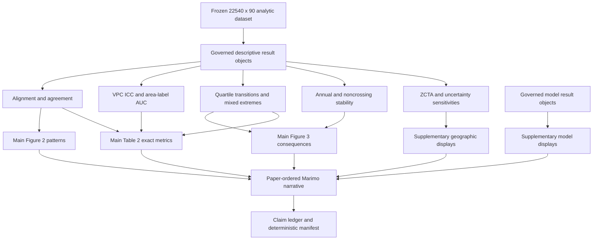

# Geographic Resolution Notebook Story and Reader Guide - Plan

## Goal Capsule

- **Objective:** Maintain the geographic-resolution paper story and add a governed reader guide that explains what each result means, what it does not mean, and why each display belongs in the main manuscript, submitted supplement, reserve supplement, or QC-only set.
- **Authority hierarchy:** Frozen source artifacts and checksums; governed descriptive result objects; existing 22,540 x 90 dataset contract; the approved SAP and noncontrolling descriptive addendum; `results_authorized=false`; then notebook prose and display metadata.
- **Stop conditions:** Do not promote a cardiometabolic coefficient, authorize the COPD estimate, call source denominators unique adults, treat PLACES as a gold standard, imply tract superiority, or make prevalence, causal, underdiagnosis, access, service-need, or national-generalizability claims.
- **Execution profile:** Characterize current manuscript-facing contracts, revise result and display schemas test-first, reorder the notebook, move model evidence to the supplement, and finish with deterministic plus browser-based publication review.
- **Tail ownership:** The executor owns code, tests, figures, tables, notebook rendering, review fixes, commits, and cleanup. Human S7 review and manuscript-result authorization remain outside implementation.

---

## Product Contract

### Summary

The notebook will present CHM as a geographic data resource and then answer whether tract-level patterns provide information that is aligned with, but not interchangeable with, public comparators and community-area summaries. Main displays will show alignment, variance across scales, quartile reclassification, highest-quartile movement, represented source denominators, mixed-extreme community areas, and annual and noncrossing stability. Outcome models will remain governed secondary analyses in the supplement.

### Problem Frame

The current notebook is organized around a cardiometabolic joint model and a COPD association model even though the strongest completed evidence is descriptive geographic complementarity. Across eligible tract frames, CHM and PLACES ranks are aligned, while direct community-area labels differ from tract quartile classifications for approximately 35% of hypertension, 39% of diabetes, and 49% of COPD observations. The noncrossing sensitivity is similar. Community areas also contain both high- and low-ranked tracts, and annual highest-quartile agreement is incomplete. The implementation must pass its comparability gate before calling those differences a consequence of coarsening.

The existing main Figure 2 and Figure 3 therefore allocate scarce manuscript space to case-specific outcome-model framing rather than the paper's strongest cross-condition result. Table 2 similarly centers a withheld cardiometabolic model and an unauthorized COPD estimate. This weakens the Introduction-to-Results logic and duplicates model evidence already available in supplementary artifacts.

### Requirements

**Main scientific story**

- R1. Reorder the reader-facing notebook as Introduction, Methods, CHM resource Results, geographic-resolution Results, Discussion, supplementary analyses, and reproducibility artifacts.
- R2. State the primary objective as geographic-resolution complementarity and preserve the boundary that alignment does not imply validation or interchangeability.
- R3. Present the existing direct CHM community-area and tract values without interpolation, tract rollup, or replacement by public comparators.
- R4. Explain the practical meaning of each geographic result for biostatisticians and nontechnical coauthors without calling tract resolution universally better.

**Main displays**

- R5. Preserve exactly five main displays in this order: CHM Table 1, resource Figure 1, geographic-alignment Figure 2, geographic-consequences Figure 3, and cross-condition Table 2.
- R6. Keep Table 1 limited to CHM community-area coverage and quality, with counts identified as geographic-condition-year observations rather than patients.
- R7. Make Figure 2 show cross-condition CHM-PLACES rank alignment and community-area-versus-tract quartile classification without repeating the exact metric table.
- R8. Make Figure 3 show highest-quartile movement, represented mean annual source denominators, mixed-extreme community areas, and annual and noncrossing stability with dynamic denominators; use “coarsening” only when the comparability gate supports that interpretation.
- R9. Replace Table 2 with a compact Great Table of exact cross-condition geographic-resolution metrics and remove model coefficients, model gates, and authorization rows from the main display.

**Supplementary analyses and governance**

- R10. Move cardiometabolic collinearity evidence and all COPD association estimates, predictions, diagnostics, spatial-error results, temporal analyses, weighting analyses, and influence analyses to numbered supplementary displays.
- R11. Preserve the cardiometabolic withholding rule at maximum VIF 5.016 and prevent its coefficient from entering any reader-facing result prose, table, figure, legend, or handoff.
- R12. Preserve the COPD adjusted estimate as a candidate secondary result with its governed 97.5% HC3 interval and `results_authorized=false`; supplementary placement must not change authorization.
- R13. Keep the direct ZCTA comparison as a secondary geographic sensitivity and distinguish ZCTAs from USPS ZIP Codes.
- R14. Report FDR-controlled spatial and uncertainty-aware agreement outputs only at the geography and source roles actually executed; explicit not-run states must remain visible.

**Publication and reproducibility**

- R15. Render main and supplementary tables with Great Tables HTML plus editable CSV, and export figures as deterministic vector PDF and high-resolution PNG.
- R16. Generate legends, prose, denominators, confidence-level labels, and authorization language from governed result objects rather than hard-coded values.
- R17. Preserve all existing artifact filenames as compatibility interfaces; update the display registry, claim-evidence ledger, supplement index, manuscript handoff, and deterministic manifest to reflect the new roles.
- R18. Keep every Marimo cell at 30 lines or fewer, place technical Markdown immediately before the governed output, and pass strict top-to-bottom and interactive rendering checks.
- R19. Generate a concise result-reading object for every main display from governed resource, alignment, consequence, and cross-condition evidence; each object must state the reader question, observed pattern, unit and denominator, uncertainty or not-run state, sensitivity status, authorization, and inference boundary.
- R20. Place a short technical interpretation and a distinct plain-language coauthor interpretation immediately after each main display without duplicating Table 2 values or creating a second uncontrolled narrative source.
- R21. Add a deterministic editorial-curation manifest that separates stable machine `display_role` from reader-facing `editorial_placement` and assigns every numbered display exactly once.
- R22. Retain the fixed five-display main manuscript set. Classify the source flow, annual quality, detailed geographic tables, and uncertainty/FDR transparency as submitted or reserve supplements; classify unauthorized model evidence as not citable pending authorization or QC-only.
- R23. Separate the main geographic reader guide from supplementary model interpretation in serialized handoff artifacts so an unauthorized COPD model narrative cannot be mistaken for the paper's primary result.
- R24. Before attributing a tract-versus-community classification difference to geographic coarsening, apply a governed same-period, same-condition comparability gate; if the gate is not met, describe the result as a direct cross-frame classification difference rather than information lost through aggregation.
- R25. Keep the geographic-resolution story explicitly descriptive; require an author-confirmed record of prespecification before any manuscript-facing language calls it a prespecified or confirmatory primary analysis.

### Main Display Contract

| Display | Reader question | Evidence role | Content boundary |
|---|---|---|---|
| Table 1 | What CHM community-area data were available? | Resource accounting | Four condition rows, 2019-2024, 1,848 records, 77 areas, denominator, eligibility, suppression, capture, reliability |
| Figure 1 | Where and how completely does CHM observe Chicago? | Resource geography and quality | Tract/community footprint, availability, suppression, capture, reliability; no model branches or coefficients |
| Figure 2 | Are tract CHM patterns aligned with public measures, and do community labels reproduce tract classifications? | Descriptive alignment and noninterchangeability | Three condition-specific rank comparisons plus three tract-versus-community quartile matrices |
| Figure 3 | What differences appear when community rather than tract classifications are used? | Decision-relevant classification consequences and stability | Q4 transitions, mean annual source denominators, mixed-extreme areas, annual and noncrossing sensitivity; “coarsening” language is conditional on the comparability gate |
| Table 2 | What are the exact cross-condition geographic-resolution metrics? | Exact estimates and denominators | Eligible tract n, Spearman rho, weighted kappa, Gwet AC1, VPC/ICC, AUC, quartile disagreement, Q4 movers; no outcome-model estimates |

### Editorial Display Map

| Placement | Displays | Reader role |
|---|---|---|
| Main manuscript | Table 1; Figure 1; Figure 2; Figure 3; Table 2 | The complete paper argument: what CHM covers, whether tract patterns align with public comparators, what a coarser community label changes, and the exact cross-condition evidence. |
| Submitted supplement | eTable 1, eTable 5, eTable 6, eTable 8, eTable 9; eFigure 1, eFigure 2, eFigure 5, eFigure 11, eFigure 12 | Traceability, detailed geographic sensitivity, annual quality, direct ZCTA context, executed spatial/FDR scope, and explicit uncertainty limitations. These support the main argument without repeating its primary visual evidence. |
| Reserve supplement | eFigure 3 and eFigure 4 | Condition-specific cardiometabolic geographic-resolution and agreement detail. Retain for reviewer requests or a longer version; do not cite them when Figure 2 already carries the cross-condition pattern. |
| Not citable pending authorization | eTable 4; eFigure 7, eFigure 9, eFigure 10 | COPD model robustness and model-estimate material. Keep deterministic exports but prohibit manuscript citation while `results_authorized=false`. |
| QC only | eTable 2, eTable 3, eTable 7; eFigure 6, eFigure 8 | Model readiness, coefficients, collinearity, diagnostics, and methods audit material. These are reproducibility records rather than reader-facing scientific evidence. |

### Acceptance Examples

- AE1. Given the frozen COPD community comparison, Figure 3 classifies 85 tracts as moving into and 40 as moving out of the highest quartile, while the displayed denominator is labeled mean annual source denominator and not unique people.
- AE2. Given a community area containing both first- and fourth-quartile tracts, the mixed-extreme panel marks that area; an area containing only middle and high quartiles is not marked.
- AE3. Given a condition with moderate-to-strong CHM-PLACES agreement and substantial community coarsening disagreement, the interpretation says aligned but noninterchangeable rather than validated or superior.
- AE4. Given noncrossing and annual sensitivity results, Figure 3 displays their observed stability or instability and does not convert a missing result into a successful finding.
- AE5. Given the cardiometabolic result object, no coefficient or confidence interval appears in main or supplementary manuscript-facing evidence; only the VIF withholding reason is shown.
- AE6. Given the COPD result object, the candidate estimate appears only in the model supplement with a dynamically generated 97.5% CI label and remains unauthorized.
- AE7. Given a ZCTA sensitivity, the supplement labels it ZCTA, states that it is a Census statistical area, and does not imply national transportability.

### Success Criteria

- A reader can follow one question from Introduction through Methods, Figures 2 and 3, Table 2, and Discussion without reading the model supplement.
- The five main displays contain no outcome-model coefficient, confidence interval, residual diagnostic, or model-readiness row.
- Figure 2 establishes alignment and classification discordance visually; Figure 3 translates discordance into tract, denominator, mixed-area, and stability consequences; Table 2 supplies exact nonduplicated metrics.
- Main prose accurately reports the frozen cross-condition direction and denominators while preserving `results_authorized=false` and all inference boundaries.
- Numbered supplements retain the complete cardiometabolic gate, COPD model, ZCTA, spatial, uncertainty, and QC evidence needed for peer review.
- Main and supplementary artifacts are deterministic, browser-clean, accessible, and linked to claim-evidence and manifest records.

### Scope Boundaries

- **In scope:** Notebook order, display data contracts, main figures and tables, supplement roles and numbering, legends, result-driven interpretation, manuscript handoff, claim ledger, tests, deterministic exports, and browser QA.
- **Compatibility boundary:** The 22,540 x 90 dataset, builder CLI and output-stem behavior, internal C1/C2 IDs, source checksums, direct CHM values, governed model objects, and current source snapshots remain unchanged.
- **Outside this product's identity:** New disease models, patient-level analyses, causal inference, prevalence estimation, predictive-superiority testing, interpolation, new public sources, or authorization of manuscript Results.
- **Deferred to Follow-Up Work:** Multi-city replication, promotion of ZCTA evidence into a main display, tract-level FDR hotspot claims if only community-area spatial results exist, and joint CHM-plus-PLACES uncertainty until a compatible uncertainty contract is governed.

---

## Planning Contract

### Key Technical Decisions

- KTD1. **Geographic consequences are the main paper result** (session-settled: user-directed — chosen over model-centered case studies: the completed results more directly support information retained or lost across geographic scales). The main Results spine will be descriptive and cross-condition.
- KTD2. **All outcome models move to the supplement** (session-settled: user-directed — chosen over retaining the COPD adjusted association as a main display: the model is unauthorized and the geographic evidence is the stronger coherent story). The main text may cite the supplementary secondary analysis without using it as the primary conclusion.
- KTD3. **Use the confirmed five-display architecture** (session-settled: user-approved — chosen over mixing model and geographic displays: the user approved a resource table and figure, two geographic figures, and one exact geographic table). Main display IDs and count remain stable while their scientific roles change.
- KTD4. **Community-area coarsening leads; ZCTA remains a sensitivity** (session-settled: user-approved — chosen over making ZCTA the primary comparison: community areas are the governed Chicago frame, while ZCTA supports a secondary external-geography angle). ZCTA results retain direct-source and comparison-only linkage semantics.
- KTD5. **Separate visual patterns from exact evidence.** Figure 2 and Figure 3 carry geography, distributions, transitions, and stability; Table 2 carries exact agreement and partition metrics. A metric may be named in a legend but should not be numerically duplicated across a main figure and Table 2 unless necessary to interpret an axis.
- KTD6. **Treat source denominators as repeated observation denominators.** Highest-quartile consequence totals use the governed mean annual source denominator and never imply unique or population-representative adults.
- KTD7. **Do not overstate local spatial evidence.** Current FDR summaries are included only with their executed geography and correction family. A tract hotspot claim requires a separately verified tract-level analysis and is deferred.
- KTD8. **Preserve internal compatibility while changing reader roles.** Existing result objects and filenames remain available to downstream contracts; stable descriptive `analysis_name`, `display_role`, and `manuscript_import_allowed` fields determine rendered placement.
- KTD9. **Use a governed “how to read this result” layer.** Each main display receives one technical reading and one plain-language reading generated from the same result object, rather than hand-authored repetition in notebook cells. The reading identifies the visual question, the pattern, the denominator, the uncertainty/not-run status, and the boundary against validation, causal, prevalence, individual-risk, or service-need claims.
- KTD10. **Keep editorial placement distinct from scientific display role.** Add `editorial_placement` to a curation manifest instead of overloading the compatibility-limited `display_role`. Main display count, supplement numbering, and authorization remain separately testable.
- KTD11. **Treat the current main set as final for the base manuscript.** The five-display cap is fully allocated to Table 1, Figures 1-3, and Table 2. A reserve display is available for reviewer requests, but no model or duplicated cardiometabolic panel displaces the cross-condition geographic argument while results are unauthorized.
- KTD12. **Gate the coarsening interpretation.** Direct tract and direct community-area CHM records are not a mechanical tract aggregation. A same-condition, same-period comparability check must pass before the notebook uses “coarsening consequence”; otherwise it uses “cross-frame classification difference” and retains the direct-value boundary.
- KTD13. **Do not imply a confirmatory primary analysis without proof.** Until the authors supply a prespecification record, label the geographic story descriptive in Methods, limitations, ledgers, and handoff artifacts; it may be central to the paper without being called a prespecified or confirmatory analysis.

### High-Level Technical Design

### Notebook Sequence

1. Introduction: resource problem, geographic-resolution question, and complementarity hypothesis.
2. Methods: source assembly and data quality, followed by alignment/agreement, variance partitioning/AUC, geographic coarsening, sensitivity, multiplicity, uncertainty, and governance methods.
3. Results — CHM resource: denominators and exclusions, Table 1, Figure 1, and resource interpretation.
4. Results — geographic resolution: alignment and noninterchangeability, Figure 2, geographic consequences and stability, Figure 3, cross-condition synthesis, and Table 2.
5. Discussion: technical interpretation, coauthor interpretation, inference-ordered limitations, and bounded conclusion.
6. Supplementary analyses: cardiometabolic collinearity gate, COPD association model and diagnostics, ZCTA comparison, spatial analyses, uncertainty feasibility, and QC displays.
7. Artifact gallery: numbered displays first, reproducibility files second, claim evidence and deterministic manifest last.

### Risks and Mitigations

- **Narrative cherry-picking:** Build every main number from a governed cross-condition schema, expose eligibility and not-run states, and retain full editable supplements.
- **Evidence duplication:** Contract-test which metrics belong in figures versus Table 2 and reject duplicate exact primary evidence.
- **Overwide Table 2:** Use Great Tables column spanners and concise cells, keep only cross-condition decision metrics in the main table, and move full intervals or sensitivity detail to eTables.
- **Denominator overinterpretation:** Generate denominator notes from metadata, label repeated mean annual source denominators, and prohibit patient or population language.
- **Model leakage into the main paper:** Validate main artifacts and manuscript handoff for model IDs, coefficients, confidence intervals, and model-gate phrases.
- **Supplement renumbering drift:** Generate first-mention numbering and cross-references from a single registry while preserving machine filenames.
- **Figure accessibility:** Use the existing color-vision-safe palette, redundant shapes or hatching, grayscale checks, direct panel labels, and journal-size inspection.
- **Authorization drift:** Assert `results_authorized=false` in result objects, tables, legends, handoff JSON, claim ledger, and run manifest.

### Sources and Research

- `notebooks/00_master_chicago_healthmap_pipeline.py` is the live reader-facing orchestration and narrative surface.
- `src/chicagohealthmap/analysis/tract_complementarity.py` contains the governed VPC/ICC, AUC, agreement, geographic consequence, and stability result builders.
- `src/chicagohealthmap/analysis/paper_displays.py` defines the five-display contract and reusable display data.
- `src/chicagohealthmap/analysis/reporting.py` owns Great Tables, legends, manuscript handoff, and reader-facing authorization boundaries.
- `outputs/notebooks/qa-geographic-consequences-20260716/` contains the frozen QA outputs that support the story and acceptance examples.
- `docs/analysis/descriptive_complementarity_analysis_addendum_draft.md` defines the descriptive analysis boundary without superseding the governed SAP.
- `docs/analysis/master_notebook_research_provenance.md` records the verified JAMA Health Forum instructions and the Tavily quota state.
- `docs/manuscript/jama_health_forum_style_guide.md` supports a compact main-display strategy with detailed secondary evidence in supplements.
- `docs/plans/2026-07-16-002-feat-geographic-consequences-zcta-plan.md` records the earlier consequence and ZCTA implementation contract; this plan supersedes only its supplement-first display decision.
- `outputs/notebooks/chm_geo_verify3/table_2_geographic_resolution.csv` supplies the governed cross-condition reading: rank alignment coexists with 35.0% hypertension, 38.7% diabetes, and 49.0% COPD quartile differences under linked direct community-area labels.
- `outputs/notebooks/chm_geo_verify3/coauthor_interpretation_guide.json` shows the current interpretation export and the need to split main geographic guidance from supplementary model guidance.
- `docs/solutions/2026-07-15-analytic-dataset-and-marimo-notebook.md` preserves the direct-value, source-role, and no-tract-rollup boundary that every interpretation must retain.

---

## Implementation Units

### U1. Define the geographic main-evidence schema

- **Goal:** Create one validated cross-condition schema that drives Table 2, main prose, legends, and claim evidence.
- **Requirements:** R2-R4, R9, R14, R16, R17, R24; KTD1, KTD5-KTD8, KTD12.
- **Dependencies:** None.
- **Files:** `src/chicagohealthmap/analysis/paper_audit.py`, `src/chicagohealthmap/analysis/paper_displays.py`, `src/chicagohealthmap/analysis/reporting.py`, `tests/unit/analysis/test_paper_audit.py`, `tests/unit/analysis/test_paper_displays.py`, `tests/unit/analysis/test_reporting.py`.
- **Approach:** Build a condition-level publication object from existing concordance, agreement, VPC/ICC, AUC, aggregation-loss, transition, mixed-extreme, and stability results. Require metric definition, eligible denominator, geography, period, uncertainty status, sensitivity status, source artifact, authorization, and a same-condition, same-period direct-frame comparability status for every row. The status governs whether reader-facing language says “coarsening” or “cross-frame.” Keep model result objects on their existing secondary path.
- **Execution note:** Start with failing schema and prohibited-main-evidence tests, then adapt existing result builders without recomputing frozen clinical values.
- **Patterns to follow:** `build_claim_evidence_audit`, `validate_analysis_result`, `build_compact_table_1`, confidence-level metadata, and explicit not-run records.
- **Test scenarios:**
  1. Hypertension, diabetes, and COPD each produce one row with the correct eligible tract denominator and all required geographic metrics.
  2. A missing condition metric creates an explicit unavailable field and source reason rather than zero or a successful result.
  3. Overall and noncrossing metrics remain distinct and retain their eligible denominators.
  4. Mean annual source denominators carry the not-unique-people unit and cannot be rendered as patient counts.
  5. The main schema contains no model ID, outcome coefficient, confidence interval, residual diagnostic, or model-readiness status.
  6. Every row retains `results_authorized=false` and a nonimportable manuscript state.
  7. A failed or unavailable comparability gate changes Figure 3, Table 2, and interpretation language to cross-frame classification differences and blocks causal-scale wording.
- **Verification:** Table, prose, legend, and claim-audit consumers can use the same validated rows without hard-coded scientific values.

### U2. Redesign Figure 2 and Figure 3 around geographic evidence

- **Goal:** Replace the case-model main figures with two publication-grade geographic-resolution figures.
- **Requirements:** R5, R7, R8, R14-R16; KTD1, KTD5-KTD7.
- **Dependencies:** U1.
- **Files:** `src/chicagohealthmap/analysis/paper_displays.py`, `notebooks/00_master_chicago_healthmap_pipeline.py`, `tests/unit/analysis/test_paper_displays.py`, `tests/unit/analysis/test_master_notebook_contract.py`.
- **Approach:** Use Figure 2 as a 2 x 3 cross-condition display: one row for CHM-versus-PLACES percentile-rank relationships and one row for community-versus-tract quartile matrices. Use Figure 3 as a compact consequence display with Q4 transition counts, mean annual source denominators, a community-area mixed-extreme map, and an annual/noncrossing stability panel. Compute all panel denominators from the plotted frame and keep exact metric estimates in Table 2.
- **Execution note:** Add synthetic display-data tests before changing the plotting cells; visual styling follows only after denominators and classifications reconcile.
- **Patterns to follow:** Central JAMA Matplotlib style, direct panel labels, `build_resolution_heatmap_data`, true polygon maps, redundant marker/hatch encoding, deterministic PDF/PNG export, and `figure_qa.json`.
- **Test scenarios:**
  1. Figure 2 has exactly six panels in the frozen condition order and includes only eligible tract records.
  2. Quartile matrices sum to 100% within condition, include explicit zero cells, and distinguish agreement from off-diagonal reclassification.
  3. Figure 3 transition counts reconcile to its eligible frame and its denominator bars reconcile to the governed mean annual source totals.
  4. The mixed-extreme map marks only community areas containing both Q1 and Q4 tracts and reports a dynamic area denominator.
  5. Annual and noncrossing panels retain condition-specific eligibility and visibly label unavailable states.
  6. Neither figure includes an outcome-model coefficient, adjusted prediction, confidence band, life-expectancy outcome, or model gate.
  7. Legends define CHM, PLACES, VPC/ICC when used, source denominator, community area, tract, and sensitivity encodings.
- **Verification:** The figures are interpretable at final journal dimensions in color, grayscale, protanopia, and deuteranopia simulations, with no clipped labels or ambiguous legends.

### U3. Replace Table 2 with exact geographic-resolution evidence

- **Goal:** Produce a compact cross-condition Great Table that supplies exact evidence without duplicating the figures.
- **Requirements:** R5, R9, R15-R17; KTD3, KTD5, KTD8.
- **Dependencies:** U1, U2.
- **Files:** `src/chicagohealthmap/analysis/paper_displays.py`, `src/chicagohealthmap/analysis/reporting.py`, `notebooks/00_master_chicago_healthmap_pipeline.py`, `tests/unit/analysis/test_paper_displays.py`, `tests/unit/analysis/test_reporting.py`, `tests/unit/analysis/test_master_notebook_contract.py`.
- **Approach:** Render three condition rows with spanners for CHM-PLACES alignment, community-area partitioning, and coarsening consequences. Keep eligible tract n, Spearman rho, weighted kappa, Gwet AC1, VPC/ICC, area-label AUC, quartile disagreement, and total Q4 movers in the main table. Put bootstrap intervals, within-variance share, denominator totals, mixed-area lists, annual values, noncrossing detail, and all models in numbered eTables.
- **Patterns to follow:** `build_great_table`, stable table IDs, JAMA `No. (%)` formatting, missing-value em dashes, source notes, raw HTML rendering, and CSV parity checks.
- **Test scenarios:**
  1. Table 2 contains exactly three condition rows and only the frozen geographic columns.
  2. Q4 movers equal moves-into plus moves-out for the same condition and eligible frame.
  3. Exact agreement metrics match their governed source artifacts and use the prespecified condition order.
  4. Missing or not-run metrics render as an em dash with an explanatory note rather than zero.
  5. Great Tables HTML and editable CSV contain equivalent values and deterministic IDs.
  6. The table contains no cardiometabolic or COPD outcome-model estimate, CI, adjustment set, gate, spatial residual, or authorization column.
- **Verification:** Table 2 is readable at manuscript width, has complete abbreviations and source notes, and does not repeat exact primary evidence already labeled in Figure 2 or Figure 3.

### U4. Reorder the Marimo narrative and interpretation

- **Goal:** Make the notebook read as one JAMA-style geographic-resolution paper before presenting supplementary analyses.
- **Requirements:** R1-R4, R6, R18; KTD1-KTD4.
- **Dependencies:** U1-U3.
- **Files:** `notebooks/00_master_chicago_healthmap_pipeline.py`, `tests/unit/analysis/test_master_notebook_contract.py`, `tests/integration/test_master_notebook.py`.
- **Approach:** Retain source assembly and dataset validation at the start of Methods, then present the descriptive methods in the same order as their Results. Move model-specific Methods, Results, sensitivities, and interpretation below the main Discussion under a clearly labeled supplementary-analysis section. Generate separate biostatistical and coauthor interpretations after each main geographic result and end with a bounded complementarity conclusion.
- **Patterns to follow:** Paper-ordered technical Markdown, calculation-validation-display-interpretation-serialization adjacency, reader-facing descriptive names, cells no longer than 30 lines, and artifact links for large machine tables.
- **Test scenarios:**
  1. The exact notebook sequence is Introduction, Methods, CHM resource, geographic alignment, geographic consequences, cross-condition table, Discussion, supplementary analyses, and artifact gallery.
  2. Figure and table first mentions occur in numerical order and immediately follow the relevant methods or Results text.
  3. Main Results include purpose, unit, denominator, missingness, uncertainty status, sensitivity status, authorization, and inference boundary.
  4. Biostatistical and coauthor interpretations use governed values and do not overstate alignment, VPC/ICC, AUC, or reclassification.
  5. No reader-facing heading uses C1, C2, Case Study, freeze candidate, or audit-only exploratory.
  6. The source stream, join ledger, dataset contract, direct-value rule, suppression distinction, and ZCTA distinction remain intact.
- **Verification:** A top-to-bottom reader can understand the resource, methods, primary evidence, practical consequences, limitations, and supplement without jumping between distant cells.

### U5. Reclassify models and extended analyses as supplements

- **Goal:** Preserve the complete governed modeling and sensitivity audit without letting it control the main paper story.
- **Requirements:** R10-R14, R17; KTD2, KTD4, KTD7, KTD8.
- **Dependencies:** U4.
- **Files:** `notebooks/00_master_chicago_healthmap_pipeline.py`, `src/chicagohealthmap/analysis/reporting.py`, `src/chicagohealthmap/analysis/paper_audit.py`, `tests/unit/analysis/test_master_notebook_contract.py`, `tests/unit/analysis/test_reporting.py`, `tests/unit/analysis/test_paper_audit.py`.
- **Approach:** Generate supplement numbering from first mention while retaining compatibility filenames. Group supplements by geographic robustness, cardiometabolic collinearity, COPD association and diagnostics, spatial analyses, uncertainty feasibility, and QC. Move the former main COPD display into the model supplement or decompose its unique panels into existing eFigures. Update the manuscript handoff so primary geographic evidence and secondary model evidence are separate namespaces with distinct import permissions.
- **Execution note:** Add leakage tests before moving cells so a model value cannot remain in a main legend, table, prose block, or handoff field by accident.
- **Patterns to follow:** `build_supplement_registry`, display roles `manuscript_candidate`/`supplement`/`qc_only`, machine-file separation, and explicit authorization objects.
- **Test scenarios:**
  1. The supplement registry numbers every eTable and eFigure once in first-mention order and preserves each existing machine filename.
  2. Cardiometabolic materials show maximum VIF 5.016 and no numeric coefficient or CI.
  3. COPD model displays use the result object's 97.5% exposure CI, 95% adjustment-term CIs where applicable, n=76, and unauthorized language.
  4. Residual, Q-Q, leverage, Cook-distance, influence, temporal, weighting, capture, Moran, and spatial-error outputs remain available and correctly classified.
  5. ZCTA displays use direct ZCTA values and comparison-only linkage metadata and never say ZIP when ZCTA is intended.
  6. FDR and uncertainty outputs preserve their executed geography, correction family, compatible source role, and explicit not-run states.
  7. Main display and main-prose scans find no model coefficient, model CI, life-expectancy association, or model authorization claim.
- **Verification:** Reviewers can inspect the complete secondary model and sensitivity evidence, while the main notebook and handoff remain geographically focused.

### U6. Reconcile legends, ledgers, deterministic artifacts, and browser QA

- **Goal:** Prove that the redesigned notebook is publication-grade, internally consistent, and reproducible.
- **Requirements:** R15-R18 and all acceptance examples.
- **Dependencies:** U1-U5.
- **Files:** `notebooks/00_master_chicago_healthmap_pipeline.py`, `src/chicagohealthmap/analysis/reporting.py`, `src/chicagohealthmap/analysis/paper_audit.py`, `tests/unit/analysis/test_master_notebook_contract.py`, `tests/unit/analysis/test_reporting.py`, `tests/unit/analysis/test_paper_audit.py`, `tests/integration/test_master_notebook.py`, `docs/analysis/chm_complementarity_evidence_ledger.md`, `docs/analysis/master_notebook_manuscript_plan.md`.
- **Approach:** Reconcile every main and supplementary claim with its source artifact, update legends and manuscript-facing planning documents, compare two clean executions, and inspect the live Marimo notebook with browser screenshots at normal and narrow widths. Run final code and document review, resolve verified findings, and preserve the unrelated coauthor brief modification.
- **Patterns to follow:** Deterministic run manifest, figure QA metadata, Great Tables CSV parity, strict Marimo validation, clean-worktree checks, and existing Compound Engineering review conventions.
- **Test scenarios:**
  1. Exactly five main displays exist in the confirmed order and each has one unique first citation and registry row.
  2. All main legends and notes define units, denominators, periods, missingness, uncertainty, sensitivities, and inference boundaries.
  3. Great Tables render without overflow or missing cells and figures render without clipped panels, illegible type, blank data regions, or misleading color scales.
  4. Two fresh script executions produce checksum-identical governed artifacts apart from intentionally excluded runtime metadata.
  5. The claim-evidence audit traces every main numeric claim to one source artifact and rejects stale former-model display claims.
  6. `results_authorized=false` is identical across notebook state, outputs, handoff, claim ledger, and manifest.
  7. The final worktree contains only intended changes plus the pre-existing unrelated `docs/analysis/coauthor_brief.html` modification.
- **Verification:** The complete quality suite passes, browser run-all has no cell errors, all publication displays pass visual review, verified code-review findings are resolved, and intended milestones are committed without pushing or opening a PR.

### U7. Build governed result-reading cards

- **Goal:** Give readers a consistent, immediately usable explanation of every main display without creating unsupported prose or duplicating exact table values.
- **Requirements:** R19, R20, R23; KTD5, KTD6, KTD9, KTD11.
- **Dependencies:** U1, U3, U4.
- **Files:** `src/chicagohealthmap/analysis/paper_displays.py`, `src/chicagohealthmap/analysis/reporting.py`, `notebooks/00_master_chicago_healthmap_pipeline.py`, `tests/unit/analysis/test_paper_displays.py`, `tests/unit/analysis/test_reporting.py`, `tests/unit/analysis/test_master_notebook_contract.py`.
- **Approach:** Derive a canonical main-result reading object from `build_geographic_main_evidence`, the resource-quality summary, and Figure 3 consequence data. For Table 1, Figure 1, Figure 2, Figure 3, and Table 2, emit: reader question, visual pattern, exact-value location, unit/denominator language, sensitivity or not-run status, authorization, and “does not establish” boundary. Render one concise technical interpretation and one distinct coauthor interpretation directly after the display. Serialize `geographic_results_interpretation.json` as the canonical reader guide; split model interpretations into a separately labeled supplementary namespace.
- **Execution note:** Characterize the current prose exports first, then add failing tests that require every new interpretation sentence to originate from a governed field or approved fixed inference-boundary vocabulary.
- **Patterns to follow:** `build_geographic_main_evidence`, `build_geographic_consequence_display_data`, `resource_coauthor_interpretation`, `coauthor_interpretation_guide.json`, reader-facing descriptive names, and Great Tables notes.
- **Test scenarios:**
  1. Each of the five main display IDs produces exactly one reading card with the required question, pattern, denominator, uncertainty, sensitivity, authorization, and boundary fields.
  2. Figure 2 interpretation reports alignment plus classification difference without treating PLACES as validation, AUC as prediction, or source observations as people.
  3. Figure 3 interpretation labels Q4 movement and annual/noncrossing findings as descriptive cross-frame classification consequences and retains their different denominators.
  4. Table 2 interpretation directs readers to the table for exact values rather than restating all three condition estimates in prose.
  5. Missing uncertainty-aware agreement and any unavailable sensitivity render an explicit not-run reason rather than optimistic language.
  6. The main reader guide contains no model identifier, model coefficient, model CI, causal, prevalence, individual-risk, or service-need claim.
  7. Supplementary model narratives remain serialized separately, explicitly unauthorized, and cannot be imported as a main interpretation.
- **Verification:** A reader can answer “what should I look at, what does it mean, and what does it not mean?” for every main display without opening a source file or a model supplement.

### U8. Add an authorization-aware editorial curation manifest

- **Goal:** Make main-manuscript versus supplement decisions visible, deterministic, and reviewable without changing compatibility-oriented display roles.
- **Requirements:** R21, R22, R23; KTD2-KTD4, KTD8, KTD10, KTD11.
- **Dependencies:** U5, U6, U7.
- **Files:** `src/chicagohealthmap/analysis/reporting.py`, `notebooks/00_master_chicago_healthmap_pipeline.py`, `tests/unit/analysis/test_reporting.py`, `tests/unit/analysis/test_master_notebook_contract.py`, `tests/integration/test_master_notebook.py`.
- **Approach:** Add a deterministic editorial curation manifest with `editorial_placement`, selection rationale, citable status, authorization requirement, first-mention order, and duplicate-main-evidence flag. Preserve `display_role` and compatibility filenames. Enforce the Editorial Display Map: exactly five main displays; submitted supplements for detailed geographic evidence and transparency; reserve supplements for duplicated condition-specific geographic panels; not-citable-pending-authorization for COPD model evidence; and QC-only for coefficient/readiness/diagnostic artifacts.
- **Patterns to follow:** `build_supplement_registry`, `supplement_table_of_contents.json`, `manuscript_results_handoff.json`, `figure_legends.json`, and explicit `results_authorized=false` propagation.
- **Test scenarios:**
  1. The curation manifest contains every numbered table and figure once, with a nonempty rationale and one valid editorial placement.
  2. The only `main_manuscript` entries are Table 1, Figures 1-3, and Table 2, in paper order.
  3. eFigures 3-4 remain reserve material because their condition-specific evidence duplicates the main geographic story; eFigure 11 remains a submitted uncertainty/transparency supplement. A reviewer request can promote reserve material only through an explicit placement change.
  4. COPD coefficient/robustness/spatial-error artifacts are not citable pending authorization while `results_authorized=false`; readiness and diagnostics remain QC-only.
  5. Submitted supplements preserve source flow, annual quality, detailed geographic tables, uncertainty feasibility, and FDR scope without creating a tract-hotspot claim.
  6. Legacy `display_role` values and machine filenames remain unchanged, while the new manifest records the more precise editorial decision.
  7. The rendered supplement index distinguishes submitted, reserve, not-citable, and QC-only displays in plain language.
- **Verification:** A coauthor can select a concise base-manuscript package and a transparent submitted supplement without inferring scientific status from a machine-oriented filename or `manuscript_candidate` label.

### U9. Reorder reader guidance and audit publication selection

- **Goal:** Make the live notebook teach the result story in the order a manuscript reader needs, then demonstrate that the display selection is publication-ready.
- **Requirements:** R19-R25; KTD1, KTD5, KTD9-KTD13.
- **Dependencies:** U7, U8.
- **Files:** `notebooks/00_master_chicago_healthmap_pipeline.py`, `tests/unit/analysis/test_master_notebook_contract.py`, `tests/integration/test_master_notebook.py`, `docs/analysis/chm_complementarity_evidence_ledger.md`, `docs/analysis/chm_complementarity_display_ledger.csv`.
- **Approach:** Add a compact “How to read these results” orienter before the main Results and preserve the display sequence: resource accounting, geographic footprint and quality, alignment/noninterchangeability, practical consequences/stability, then exact metrics. Place each result-reading card immediately after its display and before the next result. Reconcile the claim ledger and display ledger with the editorial manifest. Keep model material after Discussion under supplements; do not relocate it into the main narrative. Require the Methods, limitations, ledger, and handoff to use descriptive framing until an author-provided prespecification record permits stronger language.
- **Execution note:** Start with notebook-order and prose-leakage contract tests before moving cells. Use the browser audit to inspect whether the reader guide helps at normal viewport width without making Results visually repetitive.
- **Patterns to follow:** Technical Markdown → calculation → validation → display → technical interpretation → coauthor interpretation → serialization adjacency; 30-line cell limit; deterministic artifact links; JAMA concise result-to-interpretation rhythm.
- **Test scenarios:**
  1. The orienter names the five-display reading sequence and its bounded ecological inference without adding a new scientific claim.
  2. Each main display is followed by its two interpretation layers before the next main display or new analysis section.
  3. Main display citations and the curation manifest agree on order, title, placement, and exact count.
  4. Main Results include no model narrative other than a brief direction to the supplementary material and closed authorization state.
  5. Claim and display ledgers trace every interpretation card to its source object and reject stale model-centered reading text.
  6. Browser rendering shows Great Tables, figures, reader cards, and curation links without overflow, empty panels, duplicate values, or reader-facing internal IDs.
  7. Manuscript-facing prose cannot call the geographic analysis prespecified or confirmatory without a governed author record; otherwise it uses the approved descriptive language.
- **Verification:** The notebook explains the paper’s evidence in one pass, and the curation manifest gives coauthors a defensible answer to “why is this main, supplemental, reserve, or QC-only?”

---

## Verification Contract

| Gate | Scope | Done signal |
|---|---|---|
| Focused unit tests | `tests/unit/analysis/test_paper_audit.py`, `test_paper_displays.py`, `test_reporting.py`, `test_master_notebook_contract.py` | New main-evidence, display, supplement, and leakage contracts pass |
| Statistical unit tests | `tests/unit/analysis/test_tract_complementarity.py`, `test_spatial.py`, `test_uncertainty_analysis.py` | Existing calculations, sensitivity states, FDR roles, and uncertainty boundaries remain unchanged |
| Dataset regression | `tests/unit/analysis/test_dataset.py` | 22,540 x 90 contract, source joins, direct values, checksums, reuse, and rebuild remain valid |
| Full automated suite | Ruff check and format, mypy, full pytest | No lint, type, or regression failures |
| Marimo validation | Strict check plus top-to-bottom script execution | No dependency, cell, runtime, or serialization errors; all cells remain within the line contract |
| Determinism | Two clean notebook executions with manifest comparison | Governed output checksums match across runs |
| Display contract | Great Tables parity and main-display registry checks | Exactly five main displays; all tables editable; figures exported as PDF and PNG |
| Visual accessibility | Journal-size, grayscale, protanopia, and deuteranopia review | Labels, symbols, panels, legends, and patterns remain distinguishable |
| Browser QA | Restart live Marimo, run all, inspect tables, figures, prose, links, and narrow layout | No visible errors, overflow, blank panels, stale labels, or nonpublication styling |
| Reader-guide contracts | `test_paper_displays.py`, `test_reporting.py`, `test_master_notebook_contract.py` | Every main display has governed technical and coauthor interpretation; model prose is supplementary only |
| Editorial curation | Registry, manifest, and supplement-index tests | Five fixed main displays; every numbered display has one authorization-aware placement and rationale |
| Scientific governance | Claim-evidence, authorization, and inference-boundary audit | No cardiometabolic coefficient; COPD model supplemental and unauthorized; no prohibited claims |
| Final review | Compound Engineering code review against the pre-redesign baseline | All verified P0-P2 findings resolved and the complete suite rerun |
| Repository hygiene | Git diff and status review | Verified milestone commits exist, unrelated files are preserved, no push or PR occurs, and the intended worktree is clean apart from pre-existing user changes |

---

## Definition of Done

- U1 is complete when one governed cross-condition evidence schema drives Table 2, main prose, legends, and claim audit without model leakage.
- U2 is complete when Figure 2 and Figure 3 answer alignment, noninterchangeability, consequences, and stability at journal dimensions with reconciled denominators.
- U3 is complete when the new Great Tables Table 2 contains only exact geographic-resolution evidence and has deterministic editable parity.
- U4 is complete when the notebook reads in paper order and places model-specific material after the main Discussion.
- U5 is complete when all model, ZCTA, spatial, uncertainty, and QC evidence is retained in a coherent numbered supplement with correct authorization.
- U6 is complete when automated, deterministic, accessibility, browser, scientific, and code-review gates pass and verified findings are resolved.
- U7 is complete when the five main displays have governed, nonduplicative technical and coauthor reading cards and a separate model-interpretation namespace.
- U8 is complete when a deterministic curation manifest distinguishes main, submitted supplement, reserve, not-citable-pending-authorization, and QC-only material without breaking compatibility roles or filenames.
- U9 is complete when the notebook’s results order, reader guidance, claim ledger, display ledger, and browser rendering all support the same geographic-resolution story.
- The final diff contains no abandoned experimental plotting or narrative code, stale display roles, dead supplement entries, generated cache artifacts, or accidental edits to unrelated user files.
- The branch is left unpushed with no PR, and the live error-free notebook is opened for the user after implementation.
